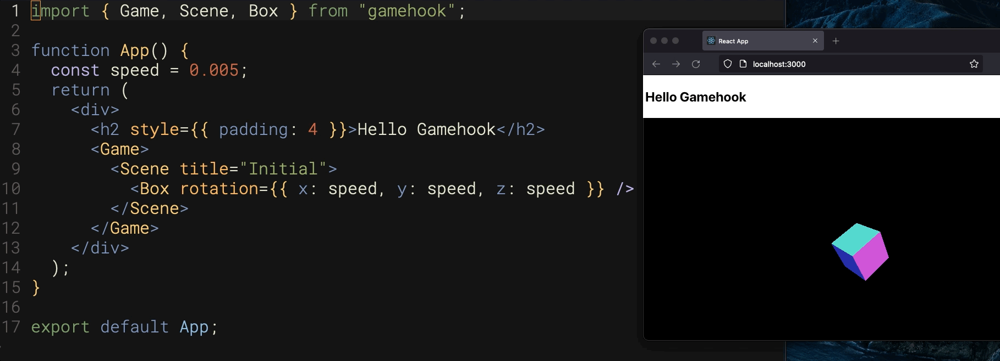

# Gamehook

Build games and have fun doing it.

## What is Gamehook?

Gamehook is a library for building games and visualizations that run in your browser. Its goal is to make developing visual experiences simpler, quicker, and more enjoyable. To do this, Gamehook provides react components that add and remove objects to a ThreeJS-powered WebGL rendering.

The end result is a greatly simplified API that will feel comfortable for react developers. Going further, Gamehook adds in some additional features provided by common game engines, such as animation, user interaction, physics, and scene routing.

Gamehook is built entirely in Typescript, and it's designed to work

The end result of React and ThreeJS working together is a convenient and developer friendly way of managing visualizations.

## Why Gamehook?

- Games built with Typescript will run in most modern browsers, without installation. It's like being able to make Flash games again, but without horrible security issues.
- It's a standard React library, so you have access to all of the nice-to-haves of the react ecosystem, including hot module reloading, state management, and all of your favorite NPM libraries.
- It's built entirely with Typescript, so all components are type-safe with editor support.
- It's fast...ish. It's not going to set any records, but most modern devices can handle rendering tens of thousands of moving objects without suffering frame rate loss.
- You can build and animate models in Blender, and then import them directly as GLTF/GLB files.

## Why Not Gamehook?

- Performance is significantly worse than a fully-featured game engine like Unreal or Unity.
- The library currently relies on client-side rendering, so it's not currently compatible with NextJS or other SSR frameworks.
- While the library does its best to make the lower-level ThreeJS objects available to developers looking for advanced features, this isn't always possible. If you plan to significantly leverage ThreeJS, some components may be limiting.

## Pre-requisites

You should know the basics of React to get started. It also helps (but is not required) if you know Typescript, and also have a rough understanding of how 3D mdodeling and animation works.

However, React is really all you need to get started with some examples that'll have you creating animations in your browser within 5 minutes of installing.

## Getting Started

Check out our [getting started](./docs/getting_started.md) guide. Once you're set up, you can read through the [component documentation](./docs/component_documentation.md) to learn more about what you can do.

## Attribution

This project has received help in many forms, and we'd like to take a moment to recognize some people who have directly or indirectly helped

### Included Resources

Several models used as examples in the project belong to a creative commons license, including:

- "phoenix bird" (https://skfb.ly/6vLBp) by NORBERTO-3D is licensed under Creative Commons Attribution (http://creativecommons.org/licenses/by/4.0/).
- "Fire_Burning_03.flac" by Foleyhaven (https://freesound.org/people/Foleyhaven/sounds/624425/)
