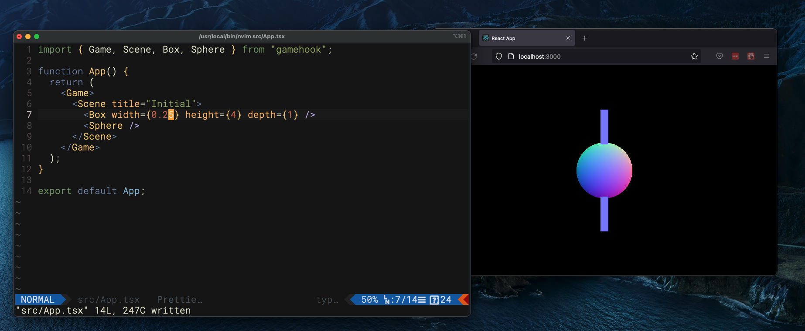

# Getting Started With Gamehook

## Installation

The library and its dependencies can be installed with either yarn or NPM

Yarn:

```
yarn install gamehook
```

NPM:

```
npm install gamehook
```

## Usage

### Game

The `Game` component is the top-level component of your project. It can be alongside other HTML, but by default all components contained within must be Gamehook components.

Fine

```
import { Game, Scene, Sphere } from 'gamehook';

const MyComponent = () => {
  return (
    <div>
      <p>Hello World</p>
      <Game>
        <Scene title='MyScene'>
          <Sphere />
        </Scene>
      <Game>
    </div>
  )
}
```

Not okay

```
import { Game, Scene, Sphere } from 'gamehook';

const MyComponent = () => {
  return (
    <div>
      <Game>
        <Scene title='MyScene'>
          <p>I am an HTML tag and should not be in the game</p>
          <Sphere />
        </Scene>
      <Game>
    </div>
  )
}
```

The `Game` component takes two optional props: `width` and `height`. If these are omitted, your game will be the size of the user's browser window.

### Scene

Each `Game` component must have one or more `Scene` components as its children. Each scene needs a "title". This is used within Gamehook's scene router to navigate from one scene to another. If your game or visualization only requires one Scene, this title may be any string you choose.

At any given time, one and only one scene will be rendered. Components within the active scene will be mounted, and the corresponding ThreeJS objects will be added to the game scene.

### Objects

Gamehook provides several components that allow you to add objects to your scenes. The simplest of these are the family of objects known as "Meshes". This includes basic shapes like Boxes, Spheres, Cylinders or Planes.

